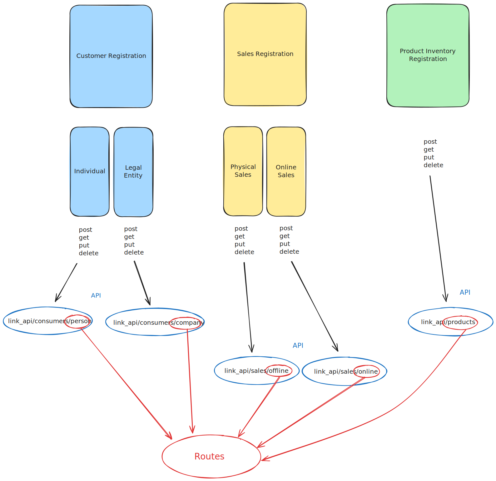
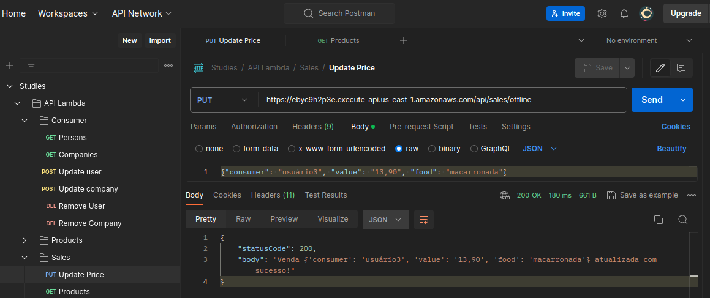

# 🚀 Serverless API for Customer, Sales, and Product Management with AWS Lambda (Python)

This project is a Serverless API developed to manage customers, sales, and products using AWS Lambda, AWS API Gateway, and DynamoDB. Deployment is done with AWS Chalice, simplifying the implementation and management of Lambda functions.

## 📌 API Architecture

The API follows this structure:

  
*Illustrative image showing the API services and endpoints.*

---

## 🌟 Features
✅ Customer registration (Individual and Business)  
✅ Sales registration (Physical and Online)  
✅ Product stock management  
✅ CRUD methods (Create, Read, Update, Delete) for each entity  
✅ Simplified deployment with AWS Chalice  

---

## 🏗️ Technologies Used
- **AWS Lambda** - Serverless computing
- **AWS API Gateway** - REST endpoint exposure
- **AWS DynamoDB** - NoSQL database
- **Python** - Backend language
- **Boto3** - AWS SDK for Python
- **AWS Chalice** - Framework for creating and managing Serverless APIs
- **Postman** - API testing

---

## 🌍 Endpoints

### 📌 Customers
| Method  | URL                        | Description                          |
|---------|----------------------------|------------------------------------|
| `POST`  | `/consumers/person`        | Create individual customer        |
| `POST`  | `/consumers/company`       | Create business customer          |
| `GET`   | `/consumers/persons`       | List individual customers         |
| `GET`   | `/consumers/companies`     | List business customers           |
| `GET`   | `/consumers/person/{id}`   | Get individual customer by ID     |
| `GET`   | `/consumers/companies/{id}` | Get business customer by ID       |
| `PUT`   | `/consumers/person`        | Update individual customer        |
| `PUT`   | `/consumers/company`       | Update business customer          |
| `DELETE`| `/consumers/person`        | Remove individual customer        |
| `DELETE`| `/consumers/company`       | Remove business customer          |

### 📌 Sales
| Method  | URL                      | Description                 |
|---------|--------------------------|---------------------------|
| `POST`  | `/sales/offline`         | Create physical sale      |
| `POST`  | `/sales/online`          | Create online sale        |
| `GET`   | `/sales/offlines`        | List physical sales       |
| `GET`   | `/sales/onlines`         | List online sales        |
| `GET`   | `/sales/offline/{id}`    | Get physical sale by ID  |
| `GET`   | `/sales/online/{id}`     | Get online sale by ID    |
| `PUT`   | `/sales/offline`         | Update physical sale     |
| `PUT`   | `/sales/online`          | Update online sale       |
| `DELETE`| `/sales/offline`         | Remove physical sale     |
| `DELETE`| `/sales/online`          | Remove online sale       |

### 📌 Products
| Method  | URL              | Description             |
|---------|----------------|---------------------|
| `POST`  | `/products`     | Add product        |
| `GET`   | `/products/{id}`| Get product        |
| `PUT`   | `/products`     | Update product     |
| `DELETE`| `/products`     | Remove product     |

---

## ⚙️ How to Run the API

### 1️⃣ Prerequisites
- **AWS CLI** configured
- **Python 3.x** installed
- **AWS Chalice** installed:
  ```bash
  pip install chalice
  ```

### 2️⃣ Installation
Clone the repository and install dependencies:
```bash
git clone git@github.com:guiipedroso/serverless-api-lambda.git
cd serverless-api-lambda
pip install -r requirements.txt
```

### 3️⃣ Deploy with AWS Chalice
To deploy to AWS using Chalice:
```bash
chalice deploy
```
This will automatically create the Lambda functions, API Gateway, and necessary configurations.

### 4️⃣ Running Locally
To test the API locally:
```bash
chalice local --port 8090
```
The API will be available at `http://localhost:8090`

---

## 📜 Testing
To run unit tests:
```bash
pytest
```
To test with Postman, import the endpoint collection (link to be added later).

---

## 📸 Test Examples

Here are some examples of tests performed on the API endpoints using Postman:

  

*The image above demonstrates requests and responses from tests performed on the API endpoints, validating their functionality.*

---

## 🛠 Contribution
Feel free to contribute! Just follow these steps:

1. Fork the repository
2. Create a new branch:
   ```bash
   git checkout -b my-feature
   ```
3. Commit your changes:
   ```bash
   git commit -m "feat: my new feature"
   ```
4. Push to the branch:
   ```bash
   git push origin my-feature
   ```
5. Open a **Pull Request**

---

## 📝 License
This project is under the MIT license.

